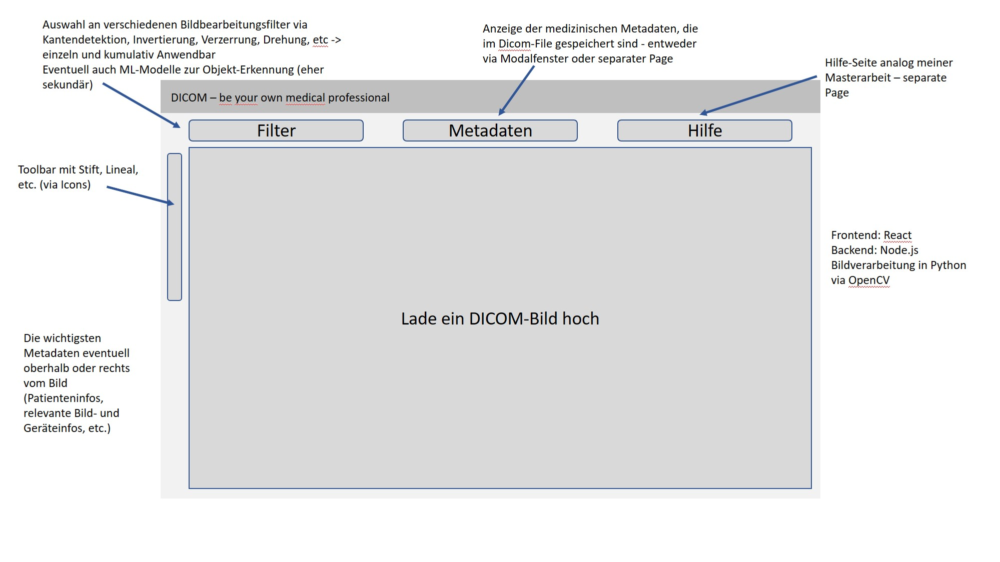

# DICOM - be your own medical professional

## Frontend - React.js

### Funktionen:

- Medizinische Bilddaten anzeigen
- Metadaten anzeigen
- Geometrische Figuren (Linie, Kreis) zeichnen
- Messung von Distanzen (anhand von Pixel berechnen)
- Segmentierung
- „Zeichnen“ —> manuelles einfärben von Bereichen

### Aufbau/Unterteilung in 3 Bereiche:

- Header mit Tools
- Ausgabe/Info Zeile
- Mainteil für Darstellung Bild

## Backend - Node.js, Python

- Bildverarbeitung mit Python Libraries
- „Berechnungen“
- Machine Learning
- Exportmöglichkeiten, d.h. Umwandlung in andere Formate wie png, jpg
- Konvertierung mit base64 für Frontend

## Mockup

#### Funktionalität WebApp

- Toolbar
  - Distanzmessung
  - Winkelmessung
  - Zeichnen
    - Farben auswählen
    - Stiftdicke
  - Geometrische Figuren
    - Kreise
    - Rechtecke
    - Pfeile
  - Lupe
  - Bildrotation
    - nach links/rechts
    - 90° Schritte
  - Spiegeln
    - vertikal
    - horizontal
 - Filter
    - Transformation
      - Drehen
      - Verzerren
    - Kantendetektion
    - Kontrastanpassung
    - Denoising
    - Windowing (inkl. Histogrammeinblendung und manueller Eingrenzung)
- Metadaten-Extraktion (Modalfenster und Name, Geburtsdatum, Geschlecht, wichtige Gerätedaten in Headerzeile; evtl. mit Auswahl über Checkboxen)
- evtl. Hilfe
- Exportmöglichkeit in andere Formate
